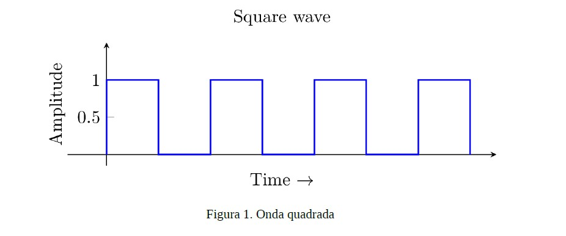

# **GUIA DE PRÁTICA**

# **SINTETIZADOR MUSICAL DE ONDA QUADRADA**

## **OBJETIVO**

### Criar um gerador de onda quadrada de frequência variável de oito botões. Cada botão apertado emite uma frequência específica seguindo a Tabela 1.

## **DESCRIÇÃO**

### Deverão ser aplicadas funções de delay para definir a frequência do pulso. Uso do PORTD para os botões e algum pino de outra porta para a saída da onda quadrada. Na Figura 1 é possível analisar uma onda quadrada. Quando nenhum botão for pressionado a saída deverá ser mantida em nível lógico zero. Os alunos deverão fazer os códigos na linguagem de programação C. Dica: usar funções **delay_ms() ou **delay_us() para o delay e usar switch-case para o tratamento das ações dos botões.

